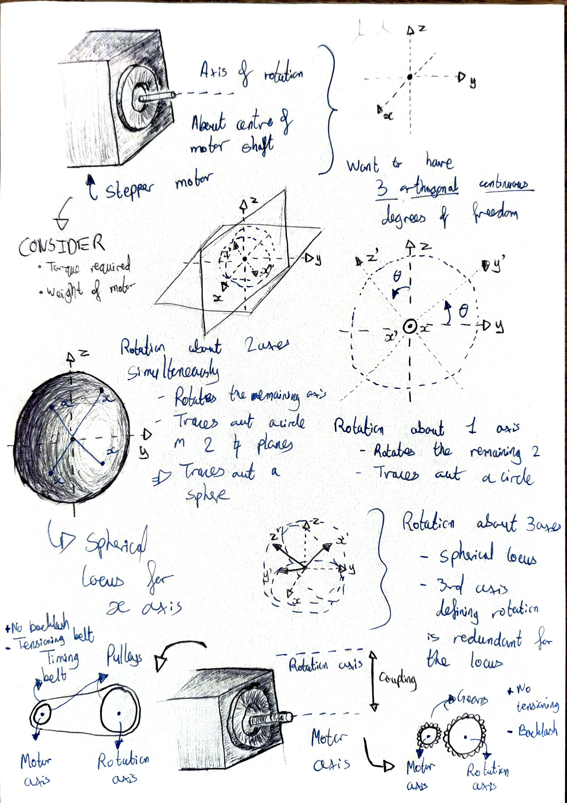
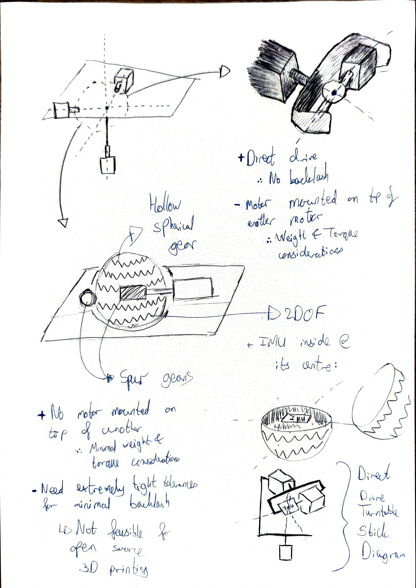
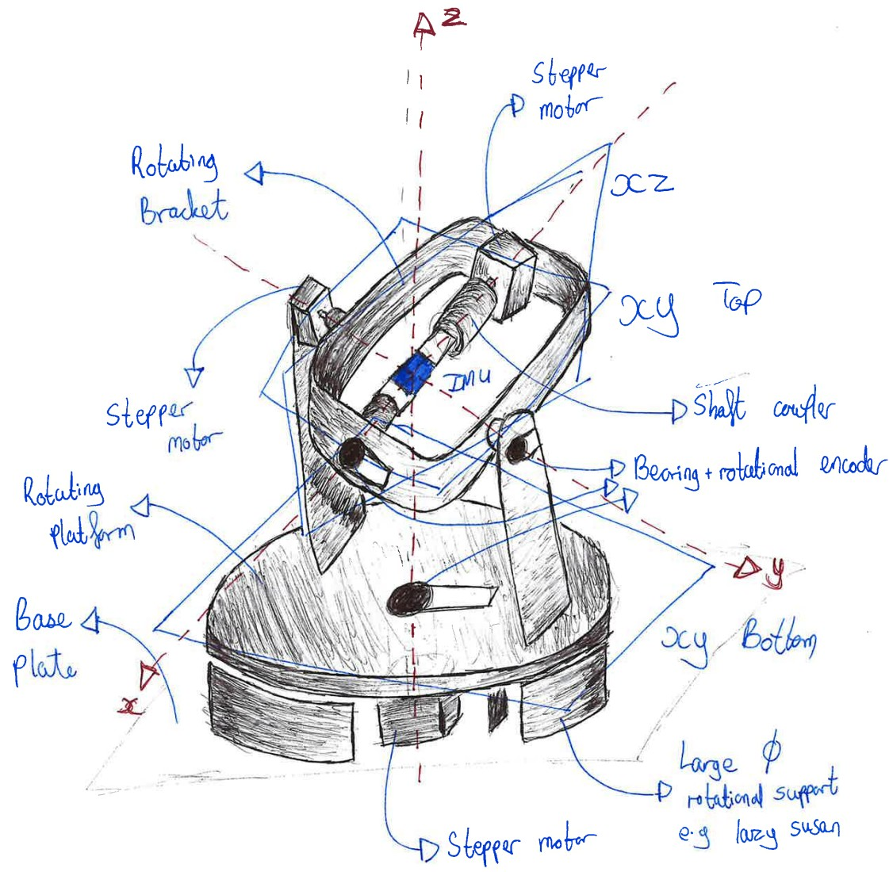
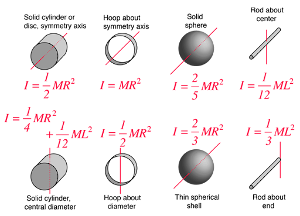
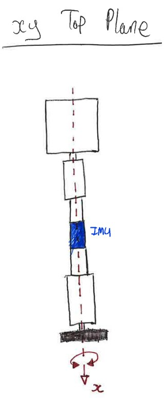
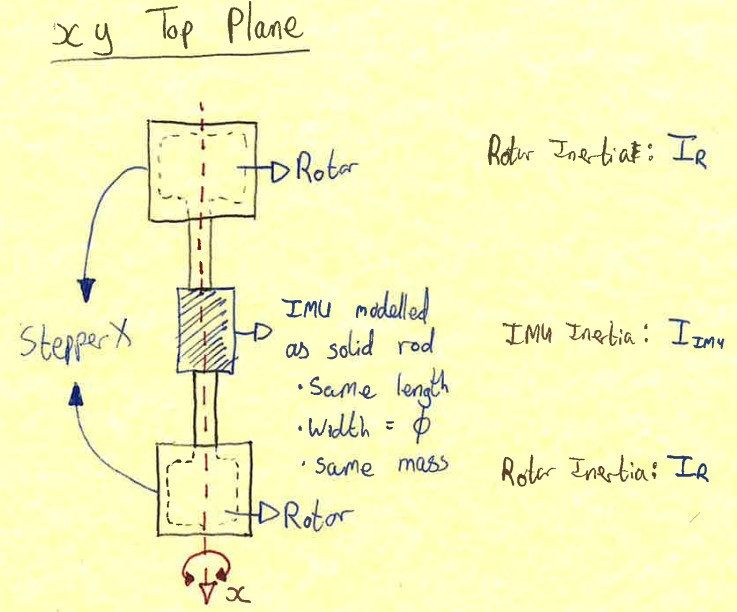
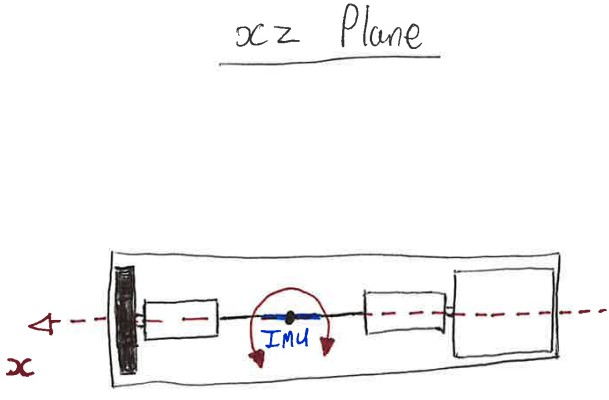
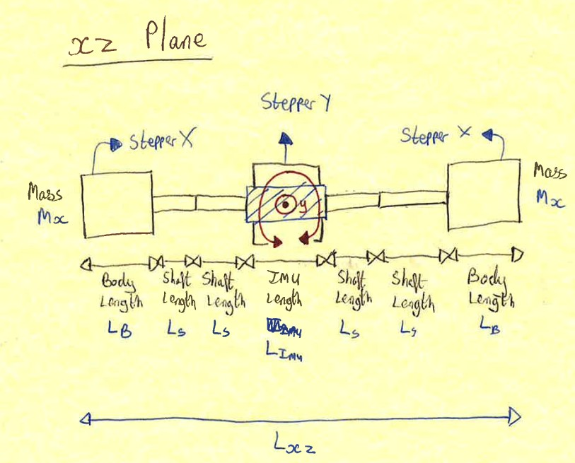
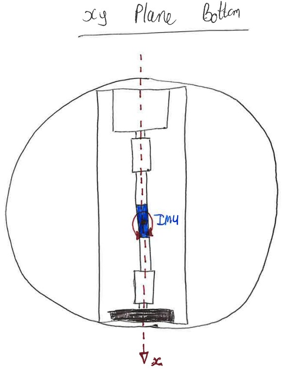
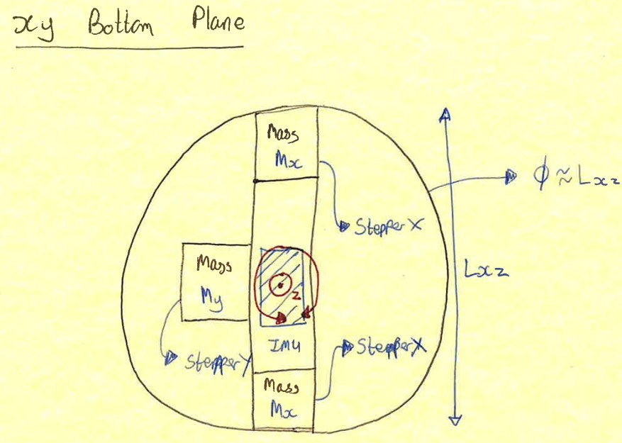

Product Requirements Document 
=============================

Contents
=========

1. [Rationale](#1-rationale)
2. [Design Brief](#2-design-brief)
3. [Existing Product Analysis](#3-existing-product-analysis) 
4. [Design Specification ](#4-initial-design-specification)
5. [Initial Design Ideas](#5-initial-design-ideas)
6. [Final Design](#6-final-design)
7. [Manufacturing](#7-manufacturing) 

## 1. Rationale 
Inertial Measurement Units (IMU sensors) widely used in wearable technologies. [Hippos Exoskeleton Incorporated](https://www.hippos.life/) are using IMU sensors in their world's first Smart Adaptive Knee Brace to prevent serious knee injuries such as ACL tears. 

In such applications, there is a demand for high frequency IMU measurements. It is also imperative to validate these high frequency IMU measurements to determine the accuracy of the IMU sensor. There is no consistent and economical method between different researchers to do so, hence why this project exists to fill that gap. 

Inertial Measurement Units (IMUs) are critical to wearable exoskeletons but lack a standardised, low-cost method to validate high-frequency data (500–1 000 Hz+) against a ground truth.

- **Problem statement:** Existing IMU validations rely on optical systems (≤240 Hz, ≈42% joint-angle error) or expensive commercial turntables, making cross-study comparison difficult.

- **Opportunity:** An open-source, 3-axis mechanical jig with rotary-encoder ground truth can deliver <9% error validation at high sampling rate

Please read *Research Proposal.pdf* for a detailed overview. 

## 2. Design Brief 
This project must produce an open-source and economical method to characterise and validate IMU sensor data against a ground truth, which can be applied across different researchers to consistently compare the accuracy of different IMU sensors at different sampling rates. 

The open-source hardware and software platform must:
1. Spin IMUs on a motorised 3 DOF jig at controlled trajectories. 
2. Log synchronous IMU and rotary-encoder data.
3. Compute and report accuracy metrics (RMSE, MAE, drift rates, Allan variance).
4. Be fully documented (CAD, firmware, analysis scripts) so that other labs can reproduce and compare results.

## 3. Existing Product Analysis
| Turntable                                                       | Rotation DoF | Rotation Range / °        | Rotation Resolution / °                         | Linear DoF | Linear range | Linear Resolution | Cost / £           | Open-Source | Source Link                                                                                                                                                    |
|-----------------------------------------------------------------|-------------:|---------------------------|-------------------------------------------------|-----------:|--------------|-------------------|--------------------|-------------|----------------------------------------------------------------------------------------------------------------------------------------------------------------|
| **iMAR iTES-PDT07**                                             | 1            | Continuous (∞)            | 0.00153 ° (5.5 arcsec)                           | 0          | N/A          | N/A               | On request         | No          | https://imar-navigation.de/en/product/ites-pdt07                                                                                                               |
| **iMAR iTURN-2D1-HIL**                                          | 2            | Continuous (∞)            | 0.00000556 ° (0.02 arcsec)                       | 0          | N/A          | N/A               | On request         | No          | https://imar-navigation.de/en/product/iturn-2                                                                                                                  |
| **iMAR iTURN-3S1**                                              | 3            | Continuous (∞)            | < 0.0002 °                                      | 0          | N/A          | N/A               | On request         | No          | https://imar-navigation.de/en/product/iturn-3s1                                                                                                                |
| **LIOCREBIF Single-Axis Rate & Position Turntable**             | 1            | Continuous (∞)            | 0.0001 °                                        | 0          | N/A          | N/A               | On request         | No          | https://www.liocrebif.com/single-axis-rate-and-position-turntable                                                                                              |
| **360° Electric Rotating Photography Turntable (B0756FVW78)**   | 1            | Continuous (∞)            | ≈ 1 ° (no encoder)                                 | 0          | N/A          | N/A               | £21                | No          | https://www.amazon.co.uk/dp/B0756FVW78                                                                                                                          |
| **JAYEGT Motorized Rotating Display Stand, 7.87 in**            | 1            | Continuous (∞)            | ≈ 0.18 ° (stepper microsteps)                     | 0          | N/A          | N/A               | £22                | No          | https://www.amazon.co.uk/dp/B07XYZ1234 (approx.)                                                                                                               |
| **OpenBuilds Compact Rotary Axis (DIY)**                        | 1            | Continuous (∞)            | 0.05625 ° (1.8°/step with 1/32 microstep)         | 0          | N/A          | N/A               | £160 (~\$200*)     | Yes         | https://openbuilds.com/builds/compact-rotary-axis-laser-engraver.10204/                                                                                         |

### Rotational Actuators 

 
 Expand 
 
There are three main types of rotational actuation methods: pneumatic, hydraulic and electric. Pneumatic systems require large volumes of compressed air and hydraulic systems require powerful pumps. Hence, they would not be suitable for such an open-source IMU turntable as pneumatic and hydraulic actuators are difficult and expensive to obtain and control. 

For electric actuation methods (motors), there are several different types: 
- DC Motors 
    - DC Shunt Motor 
    - Separately Excited DC Motor 
    - Series DC Motor 
    - PMDC Motor 
    - Compound Motor 
- AC Motors 
    - Induction Motor 
        - 1 Phase Induction Motor 
        - 3 Phase Induction Motor 
    - Synchronous Motor 
- Special Motors 
    - Stepper Motor 
    - Brushless Motor 
    - Universal Motor 
    - Hysterisis Motor 
    - Reluctance Motor 
    - Linear Motor 

Comparing all of the motors against the design brief and specification: 
| **Motor Type**                   | **Approx. Angular Resolution**                                                                                                                                                                                                                                                                                                                                                                | **Control Method**                                                                                                                                                                                                                                                 | **Ease of Open-Source Control**                                                                                                                                                                                                                                   | **Accessibility (Motor & Controller)**                                                                                                                                                                                                                                                                                | **Notes/Comments**                                                                                                                                                                                                                                                                                                                                                                                                                                                                                                                                                                                                              |
|----------------------------------|------------------------------------------------------------------------------------------------------------------------------------------------------------------------------------------------------------------------------------------------------------------------------------------------------------------------------------------------------------------------------------------------|---------------------------------------------------------------------------------------------------------------------------------------------------------------------------------------------------------------------------------------------------------------------|-------------------------------------------------------------------------------------------------------------------------------------------------------------------------------------------------------------------------------------------------------------------|--------------------------------------------------------------------------------------------------------------------------------------------------------------------------------------------------------------------------------------------------------------------------------------------------------------------------|------------------------------------------------------------------------------------------------------------------------------------------------------------------------------------------------------------------------------------------------------------------------------------------------------------------------------------------------------------------------------------------------------------------------------------------------------------------------------------------------------------------------------------------------------------------------------------------------------------------------------------------------------------------------------------------------------|
| **DC Shunt Motor**               | • No inherent positional resolution (continuous). • With external encoder: resolution = encoder CPR (e.g. 1000–5000 pulses/rev → 0.36–0.072°).                                                                                                                                                                                                                                                     | • Voltage/PWM to armature; field winding current is separately regulated (constant–voltage). • Closed-loop position/velocity requires a separate encoder + PID.                                                                                                   | • Moderate: plenty of open-source H-bridge/PWM drivers (e.g. VNH2SP30, L298N), open-source PID libraries (Arduino, Python). • But you must pair with an encoder board and write/modify control firmware.                                                                 | • DC shunt motors (small-frame) are somewhat uncommon compared to PMDC. You’ll likely end up using a small PMDC + stiff field winding rather than commercial “shunt”-type anyway. • Encoder modules (optical/Hall sensor) are off-the-shelf.                                | • Without an encoder, you have zero positional resolution—only speed control. • With a good encoder and a well-tuned PID loop, you can get “encoder resolution” (e.g. a 2000 CPR encoder → 2000 steps/rev → 0.18° per step). • But this adds mechanical coupling, cost, and closed-loop complexity.                                                                                                                                                                                                                                    |
| **Separately Excited DC Motor**  | • Same as DC Shunt: continuous. With encoder only.                                                                                                                                                                                                                                                                                                                                               | • Armature PWM/voltage + independent field current supply. • Position/velocity control via separate encoder + PID.                                                                                                       | • Moderate: open-source drivers for armature. • You also need to drive field winding (often constant DC). For position, same as above (external encoder + PID).                                                                                             | • Rare to find small (<100 W) commercial “SEDC” motors cheaply. • Encoders sold separately.                                                                                                                                                                                                                          | • Very similar trade-off as DC Shunt. • Slightly more complex field supply but resolution still comes from encoder.                                                                                                                                                                                                                                                                                                                                                                                                                                                                                                               |
| **Series DC Motor**              | • Continuous unless you clamp/inject feedback via encoder. With encoder: same as above.                                                                                                                                                                                                                                                                                                            | • Armature & field current in series → torque varies with load. • Position/velocity control only via encoder + PID.                                                                                                        | • Moderate-Low: series DCs are less common for precise control (more used for high-speed or heavy loads). • Open-source PWM drivers exist, but closed-loop tuning is tricky.                                                                   | • Series DCs are mostly used in industrial big-frame (e.g. traction). • Not recommended for small precision tabletop setups.                                                                                                                                                                                        | • Not typically chosen for low-speed/high-precision tasks because torque changes nonlinearly with load. • Encoder required for any positional control → same complexity as PMDC.                                                                                                                                                                                                                                                                                                                                                                                                                                                     |
| **PMDC Motor**                   | • Continuous rotation. • With external encoder: depends on encoder (e.g. 1000 CPR yields 0.36°/step).                                                                                                                                                                                                                                                                                            | • PWM/analog voltage on armature. • Closed-loop via encoder + PID.                                                                                                                                                     | • Moderate: a huge variety of open-source H-bridge drivers (e.g. L298, BTS7960, Pololu Motor Drivers) and PID libraries. • You still need to attach an encoder (often 6–12 mm optical/line encoder modules).                                                           | • Very common: 12 V/24 V hobby-grade PMDC motors, cheap. • Encoders widely available (e.g. 512–4096 CPR). • Controllers: easy to source (Arduino shields, Pololu, etc.).                                                                                             | • Many DIY IMU turntables use a PMDC + high-resolution encoder. • You’ll need to machine or 3D-print a coupling to mount the encoder disc. • Control loop tuning (PID) is doable but adds software complexity vs. open-loop stepper.                                                                                                                                                                                                                                                                                                                                                         |
| **Compound Motor**               | • Same as other DC: continuous. With encoder: same as above.                                                                                                                                                                                                                                                                                                                                      | • Combination of series & shunt field windings; control as “DC motor + encoder.”                                                                                                                                           | • Moderate: identical to DC motors above, but field structure is more complex.                                                                                                                                                    | • Rare—compound DC motors default to larger-frame/industrial sizes.                                                                                                                                                                                                   | • Overkill for a small, low-power turntable. • Complexity and cost go up for marginal gain over PMDC.                                                                                                                                                                                                                                                                                                                                                                                                                                                                                                                                                                |
| **1 Phase Induction Motor**      | • No inherent positional resolution (just speed). • Typically no encoder in standard usage.                                                                                                                                                                                                                                                                                                     | • AC supply ± V/f control or VVVF (variable-voltage variable-frequency). • For position: must retrofit encoder + VFD with encoder feedback (closed-loop).                                                              | • Low: open-source VFD+firmware exist (e.g. OpenVFD), but complex to set up. • Tuning AC V/f control with encoder feedback is nontrivial.                                                                                        | • Small single-phase induction motors are common (ceiling fans, etc.) but rarely sold as “servo-ready.” • VFDs with encoder inputs are industrial gear.                                                                           | • Not practical for precision. • Difficult to source a “small” 1 phase induction motor combined with a VFD that can do position-loop.                                                                                                                                                                                                                                                                                                                                                                                                                                                                                                         |
| **3 Phase Induction Motor**      | • Continuous; needs external encoder for any position control (like 1024 CPR → 0.35°).                                                                                                                                                                                                                                                                                                            | • 3-phase inverter (VFD) → V/f open loop or vector control closed loop (with encoder).                                                                                                                                    | • Low: projects like OpenInverter & ODrive support BLDC/AC motors, but setting up sensorless or encoder-based FOC for an IM is advanced. • Requires a multi-kW inverter normally.                                           | • Small 3-phase induction motors (e.g. 0.5–2 kW) are available but need a matching VFD. • Commercial VFDs are expensive and not plug-and-play.                                                                               | • Overkill power & complexity. • Hard to find a compact open-source solution for 3 phase IM position control at tabletop scales.                                                                                                                                                                                                                                                                                                                                                                                                                                                                                                   |
| **Synchronous Motor**            | • Continuous; with resolver/encoder you get resolution = sensor CPR (e.g. 1024 CPR).                                                                                                                                                                                                                                                                                                               | • Synchronous inverter drive (FOC) with encoder/resolver feedback. • Position loop in the inverter.                                                                                                                       | • Medium-Low: some open-source ESC projects handle BLDC, but true AC synchronous (e.g. permanent magnet synchronous) with encoder is rarer. • Requires writing/using FOC code.                                            | • Small permanent-magnet synchronous motors (PMSM) exist (same as BLDC stator). • Controllers: ODrive or similar can drive PMSM, but hardware is more expensive than stepper drivers.                                                                                | • If you treat a PMSM like a BLDC (just use FOC + encoder), resolution is same story as BLDC. • More complexity than a stepper for similar closed-loop accuracy.                                                                                                                                                                                                                                                                                                                                                                                                                                                                                                                  |
| **Stepper Motor**                | • Native step angle: typically 1.8° (200 steps/rev) or 0.9° (400 steps/rev). • Microstepping → up to 1/256 microstep.                                                                                                                                                                                                                                             | • Open-loop step pulses (e.g. STEP/DIR) to driver (A4988, DRV8825, TMC²X). • Closed-loop (optional) with encoder but often not needed if torque is adequate.                                                             | • Very High: virtually all major open-source platforms (Arduino, Raspberry Pi, etc.) have libraries for step/direction. • Numerous open hardware drivers (e.g. BigTreeTech, CNC shield, TMC drivers).                         | • Ubiquitous: NEMA 17, NEMA 23 stepper motors are cheap. • Drivers like A4988 (<\$2) or TMC2209 (<\$10) are open source/hardware friendly.                                                                                                | • Industry standard for DIY turntables, 3D printers, CNC. • No encoder needed unless you want absolute position, since open-loop step is predictable. • If you microstep and drive smoothly, you can achieve <0.05° resolution easily. • Torque tapers at very high microstep frequencies—choose a low RPM application.                                                                                                                                                                                                                                                                         |
| **Brushless Motor** (BLDC/PMSM)   | • No inherent position resolution; requires external encoder/ITR. • With 500 CPR encoder on rotor: 0.72° per count, but FOC interpolation can give ~0.1°.                                                                                                                                                                                                                                         | • 3-phase ESC or driver (with FOC). • With encoder or Hall sensors → closed-loop position. • Without sensor → sensorless control (not recommended for precise stepping).                                               | • Medium: boards like ODrive (open-hardware) or SimpleFOC (STM32) let you do FOC + encoder. • More firmware overhead than a stepper.                                                                                            | • Brushless hobby motors are cheap; need to add a 3-phase inverter board + encoder. • ODrive boards start at ~$100; SimpleFOC shields exist.                                                                                              | • Smooth motion and high-speed capability. • More complex wiring (3 phases + encoder). • Open-source BLDC drivers exist but require learning FOC concepts. • You can tune so that effectively you get sub-degree control, but it’s not as “plug & play” as a stepper.                                                                                                                                                                                                                                                                                                                  |
| **Universal Motor**               | • Continuous; requires an encoder for position resolution only.                                                                                                                                                                                                                                                                                                                                  | • Runs off AC or DC (brush + commutator). • Speed roughly ∝ voltage/load. • Position control → PWM + encoder + PID.                                                                                                  | • Low: open-source H-bridge PWM control can run it on DC. • But brushes introduce noise; closed-loop tuning is not common.                                                                                                | • Found in power tools/household; not generally sold by RPM characteristics. • Encoder + coupling required.                                                                                                                                            | • Not used for precision positioning; mostly high-speed tools. • Brush noise, variable torque curve.                                                                                                                                                                                                                                                                                                                                                                                                                                                                                                                                       |
| **Hysteresis Motor**               | • Often used in analog timing; continuous. • No built-in position feedback. • With external encoder: same as DC.                                                                                                                                                                                                                                                                             | • AC drive at rated frequency; torque due to hysteresis; constant speed so good for timers. • Position control only via external encoder + special driver.                                                               | • Very Low: rare to find open hardware for hysteresis motor control. • Most commercial units come as “black box” synchronous timers.                                                                                                | • Extremely niche; mostly in lab instrumentation (analytical balances, audio turntables decades ago).                                                                                                                                                | • Very expensive, low-torque. • Rarely sold off-the-shelf for DIY.                                                                                                                                                                                                                                                                                                                                                                                                                                                                                                                                                                      |
| **Reluctance Motor**              | • Continuous. • Position control requires resolver or encoder.                                                                                                                                                                                                                                                                                                                                  | • 3-phase inverter (FOC or reluctance-specific drive). • Position loop in inverter if encoder/resolver present.                                                                                                              | • Low: open-source FOC for reluctance motors is uncommon. • You’d basically need a commercial servo drive.                                                                                                                   | • Rarely sold at small scales. • More used industrially (traction, servo); not easy to source cheap.                                                                                                             | • Not a practical choice unless you already have one.                                                                                                                                                                                                                                                                                                                                                                                                                                                                                                                                                                                        |
| **Linear Motor** (not rotary)     | • N/A for angular application.                                                                                                                                                                                                                                                                                                                                                                     | • Typically voice-coil style (for small); linear brushless for larger.                                                                                                                                                       | • Low: open-source happens mainly in pick-and-place robotics, but not relevant for a rotary turntable.                                                                                                                               | • Widely available as linear actuators but useless for rotation.                                                                                                                                                                                                                                         | • You’d have to convert linear → rotary (belt or gear) which adds inaccuracy.                                                                                                                                                                                                                                                                                                                                                                                                                                                                                                                                                                  |

The most feasible motors to use are **stepper motors** because they: 
- Can rotate to discrete positions which can be sequentially combined to make them follow continuous rotation trajectories very accurately 
- Have a native angular resolution of 1.8° or 0.9° which can be microstepped up to 1/256 => Hence, a maximum achieveable resolution (with 0.9° native resolutio and 1/256 microstep) is **0.0035°** per microstep 

Using stepper motors, an open-source IMU turntable can be designed in [Initial Design Ideas: Stepper Motor Design](#stepper-motor-design). 

### Specific Stepper Motors 

 
 Expand 

| Model              | NEMA Size       | Step Angle (°) | Holding Torque (N·cm) | Dimensions (mm)               | Mass (kg) | Rotor Intertia (gcm2) | Datasheet Link                                                                                         |
|--------------------|-----------------|----------------|-----------------------|-------------------------------|-----------|--------------------------------------------------------------------------------------------------------|-----------------------------------------|
| **14HR05-0504S**   | NEMA 14 (Φ36.5) | 0.9            | 5                     | Φ36.5 × 12.5; shaft Φ5×10.5   | 0.06      | 11.00 | [14HR05-0504S.pdf](https://www.oyostepper.com/images/upload/File/14HR05-0504S.pdf)                      |
| **14HR08-0654S**   | NEMA 14 (Φ36)   | 0.9            | 8                     | Φ36 × 20; shaft Φ5×15.5       | 0.13      | 13.00 | [14HR08-0654S.pdf](https://www.oyostepper.com/images/upload/File/14HR08-0654S.pdf)                      |
| **14HM08-0504S**   | NEMA 14 (35×35) | 0.9            | 5                     | 35 × 35 × 20                  | ~0.10      | 8.00 | [14HM08-0504S.pdf](https://www.omc-stepperonline.com/download/14HM08-0504S.pdf)                          |
| **14HM11-0404S**   | NEMA 14 (35×35) | 0.9            | 11                     | 35 × 35 × 11.5                | 0.12      | 10.00| [14HM11-0404S.pdf](https://www.oyostepper.com/images/upload/File/14HM11-0404S.pdf)                      |
| **16HM09-1204S**   | NEMA 16 (Φ39)   | 0.9            | 11                     | Φ39 × 24                      | 0.10      | 10.00 | [16HM09-1204S.pdf](https://www.omc-stepperonline.com/download/16HM09-1204S.pdf)                      |
| **16HM10-0604S**   | NEMA 16 (Φ39)   | 0.9            | 16                    | Φ39 × 24                      | 0.12      | 11.00 | [16HM10-0604S.pdf](https://www.oyostepper.com/images/upload/File/16HM10-0604S.pdf)                      |
| **16HM13-0404S**   | NEMA 16 (Φ39)   | 0.9            | 18                    | Φ39 × 28                      | 0.18      | 20.00 | [16HM13-0404S.pdf](https://www.oyostepper.com/images/upload/File/16HM13-0404S.pdf)                      |
| **16HM17-0304S**| NEMA 16 (Φ39)   | 0.9            | 25                    | Φ39 × 34                      | 0.25      | 36.00 | [16HM17-0304S.pdf](https://www.oyostepper.com/images/upload/File/CN-16HM17-0304S.pdf)                 |
| **17HM08-1204S**   | NEMA 17 (42×42) | 0.9            | 11                     | 42 × 42 × 20                  | 0.15      | 14.00 | [17HM08-1204S.pdf](https://www.oyostepper.com/images/upload/File/17HM08-1204S.pdf)                      |
| **17HM13-0316D**   | NEMA 17 (42×42) | 0.9            | 23                    | 42 × 42 × 34                  | 0.28      | 38.00 | [17HM13-0316D.pdf](https://www.oyostepper.com/images/upload/File/17HM13-0316D.pdf)                      |
| **17HM13-0316S**   | NEMA 17 (42×42) | 0.9            | 23                    | 42 × 42 × 34                  | 0.28      | 38.00 | [17HM13-0316S.pdf](https://www.oyostepper.com/images/upload/File/17HM13-0316S.pdf)                      |
| **17HM15-0406S**   | NEMA 17 (42×42) | 0.9            | 26                    | 42 × 42 × 39                  | 0.28      | 54.00 | [17HM15-0406S.pdf](https://www.oyostepper.com/images/upload/File/17HM15-0406S.pdf)                      |
| **17HM15-0904S**   | NEMA 17 (42×42) | 0.9            | 36                    | 42 × 42 × 40                  | 0.28      | 54.00 | [17HM15-0904S.pdf](https://www.oyostepper.com/images/upload/File/17HM15-0904S.pdf)                      |
| **17HM15-1004S**   | NEMA 17 (42×42) | 0.9            | 33                    | 42 × 42 × 40                  | 0.31      | 54.00 | [17HM15-1004S.pdf](https://www.oyostepper.com/images/upload/File/17HM15-1004S.pdf)                      |
| **17ME15-1504S**   | NEMA 17 (42×42) | 0.9            | 30                    | 42 × 42 × 38                  | 0.28      | - | [17ME15-1504S.pdf](https://www.oyostepper.com/images/upload/File/17ME15-1504S.pdf)                      |
| **17HM19-0406D**   | NEMA 17 (42×42) | 0.9            | 32                    | 42 × 42 × 48                  | 0.35      | 68.00 | [17HM19-0406D.pdf](https://www.oyostepper.com/images/upload/File/17HM19-0406D.pdf)                      |
| **17HM19-1684S**   | NEMA 17 (42×42) | 0.9            | 44                    | 42 × 42 × 47                  | 0.35      | 68.00 | [17HM19-1684S.pdf](https://www.oyostepper.com/images/upload/File/17HM19-1684S.pdf)                      |
| **17HM19-1684D**   | NEMA 17 (42×42) | 0.9            | 44                    | 42 × 42 × 48                  | 0.35      | 68.00 | [17HM19-1684D.pdf](https://www.oyostepper.com/images/upload/File/17HM19-1684D.pdf)                      |
| **17HM19-2004S**   | NEMA 17 (42×42) | 0.9            | 46                    | 42 × 42 × 48                  | 0.40      | 82.00 | [17HM19-2004S.pdf](https://www.oyostepper.com/images/upload/File/17HM19-2004S.pdf)                      |
| **17HM19-2004S1**  | NEMA 17 (42×42) | 0.9            | 46                    | 42 × 42 × 48                  | 0.37      | 68.00 | [17HM19-2004S1.pdf](https://www.oyostepper.com/images/upload/File/17HM19-2004S1.pdf)                    |
| **23HM22-2804S**   | NEMA 23 (57×57) | 0.9            | 115                    | 57 × 57 × 56                  | 0.70      | 300.00 | [23HM22-2804S.pdf](https://www.oyostepper.com/images/upload/File/23HM22-2804S.pdf)                      |

Using this data, appropriate stepper motors can be selected for each axis of rotation, shown in [Final Design: Stepper Motor Selection Calculations](#stepper-motor-selection-calculations).

## 4. Design Specification  
The open-source IMU turntable must: 
1. 3 degrees of rotational freedom 
2. 360° of rotation about all three axes 
3. Rotational resolution of at least 0.05625°
4. **As cheap as possible** 
5. Variable trajectory control of the turntable 
6. IMU sensor datalogging at variable frequencies 
7. Temporal synchronisation of the IMU data and turntable motion 

## 5. Initial Design Ideas 
From *Research Proposal.pdf*, the following selections have been made: 

### IMU Sensors: 
The following IMU sensors were selected due to their variety in sampling frequency specified on their datasheet and due to the support of SPI. 

**SPI will be used** to transfer IMU data to the datalogger as it is the fastest digital communication protocol between I2C and UART. 

| IMU Sensor | Communication Protocol | Sampling Frequency / Hz | Angular Resolution / ° s^{-1} | Bit Depth |
|------------|------------------------|-------------------------|-----------------------|-----------|
| Analog Devices ADIS16470 | SPI | 5000 | ±2000 | 16 - 32 bit | 
| InvenSense ICM-20602 | SPI and I2C | 1 - 32000 | ±2000 | 16 bit | 
| Bosch BMI088 | SPI and I2C | 2000 | ±2000 | 16 bit |
| Ceva BNO085 | SPI, I2C and UART | 1000 | ±2000 | 16 bit |

 

From the initial design ideas, a direct drive system is the most feasible because *accuracy and precision* are a priority, so **zero backlash** is a necessity. With such a system, the maximum attainable resolution must be further investigated by researching existing rotational actuators e.g stepper motors in [Existing Product Analysis: Rotational Actuators](#rotational-actuators). 

### Stepper Motor Design

 
 Expand 

Initial design sketch of an open-source IMU turntable actuated using stepper motors: 

 
The drawback with using such a direct drive system is that the stepper motor at the base will have a greater load than the stepper motor at the top because the mass of the turntable + IMU > mass of IMU. **Next step** is to figure out which specific stepper motors to use - for that: 
- Need to research which specific stepper motors there are in [Existing Product Analysis: Specific Stepper Motors](#specific-stepper-motors) and their corresponding torques, dimensions and mass 
- Need to determine which combination of stepper motors to use and where, shown in [Final Design: Stepper Motor Selection Calculations](#stepper-motor-selection-calculations)

## 6. Final Design 

### Stepper Motor Selection Calculations

 
 Expand 

- The [Firepower 2TS-450](https://www.accelerometergyro.com/sale-30377756-remote-control-position-rate-turntable-for-ins-imu-test-and-calibration.html) has a maximum angular acceleration of 300 °s^{-2} = **5.236 rads^{-2}**
- **Motor Torque = Load Torque + Friction Torque**, where **Torque = Inertia x Angular Acceleration** 
    - For load torque, **load inertia** depends on the mass and size of the IMU and the frame it's attached to 
    - Friction torque can be modelled as the torque required to spin ANOTHER motor shaft. That's because a bearing + rotary encoder would be used on the other side of the rotating axis. Specific components for the bearing + rotary encoder are yet to be selected, so by modelling them as ANOTHER motor shaft, it gives an OVERESTIMATE to the torque required from the motor. 
- The IMU sensor can be modelled as a solid rod of uniform density by using the maximum mass and dimensions from the list of IMU sensors in the [Initial Design Ideas](#5-initial-design-ideas): 
    - Maximum mass: **11.86g** of the ADIS16470 
    - Maximum length: **15.25mm** of the ADIS16470 

 

Hence, **I_IMU** = 1/2 x 11.86E-3 x (15.25E-3)^2 = **1.379E-6 kgm^2**

#### Stage X: Rotation about the X axis 
 =>  

Since a parts list hasn't been finalised yet, the following modelling assumptions are made to approximate the inertia: 
- Rotor inertia of the stepper motor causes a greater resistance to rotation than the friction in a ball bearing as the rotor has a greater mass than just a rotational axis. Hence, by modelling the resistance to motion due to a ball bearing as the inertia of a rotor will provide an overestimate. 
- Hence, total inertia the motor has to rotate = X Rotor Inertia (I_RX) + IMU Inertia (1.379E-6) + X Rotor Inertia (I_RX)

**=> X Motor Torque = (2I_RX + 1.379E-6)kgm^2 (5.236)rads^{-2}**

#### Stage Y: Rotation about the Y axis 
 => 

Since a parts list hasn't been finalised yet, the following modelling assumptions are made to approximate the inertia: 
- Modelled as a solid rod rotating about its centre normal to its curved surface  
- Mass of rod approx. = (Mass of 2 X stepper motors) + IMU mass 
- Length of rod = 2LB_X + 4LS_X + L_IMU 
- Hence, total inertia by modelling the bearing support to have the same inertia as the Y motor = [1/12 x (2M_X + 11.86E-3) x (2LB_X + 4LS_X + 15.25E-3)^2] + 2 Rotor Inertia (2 I_RY) 

**=> Y Motor Torque = (1/12 (2M_X + 11.86E-3) (2LB_X + 4LS_X + 15.25E-3)^2 + 2 I_RY)kgm^2 (5.236)rads^{-2}**

#### Stage Z: Rotation about the Z axis 
 => 

Since a parts list hasn't been finalised yet, the following modelling assumptions are made to approximate the inertia: 
- Modelling the rotating platform as an uniform-density rod rotating about its centre that is normal to its face 
- Mass of platform approx. = 2M_X + 2M_Y + M_IMU (assuming mass of Y axis support = M_Y)
- Radius of platform approx. = 1/2 L_XZ = 1/2 (2LB_X + 4LS_X + L_IMU) 
- Total inertia (assuming platform support has same inertia as Z Rotor Inertia) = 1/2 (2M_X + 2M_Y + 11.86E-3) (1/2 (2LB_X + 4LS_X + L_IMU))^2 + 2 I_RZ 

**=> Z Motor Torque = (1/8 (2 M_X + 2 M_Y + 11.86E-3) (2 LB_X + 4 LS_X + 15.25E-3)^2 + 2 I_RZ)kgm^2 (5.236)rads^{-2}**

#### Modelling Different Combinations of Stepper Motors 
As a safety factor, stepper motors will be selected with **at least 10x** the torque than the calculated required torque. 

The variables required are as follows: 
- I_RX: X Rotor Inertia in kgm^2 
- M_X: X Stepper Motor Mass in kg 
- LB_X: X Stepper Motor Body Length in m 
- LS_X: X Stepper Motor Shaft Length in m
- I_RY: Y Rotor Intertia in kgm^2 
- M_Y: Y Stepper Motor Mass in kg 
- I_RZ: Z Stepper Motor Rotor Inertia in kgm^2 

The constants used are as follows: 
- Maximum IMU Mass: 11.86E-3 kg
- Maximum IMU Length: 15.25E-3 m 
- Angular acceleration: 5.236 rads^{-2}

A [Python Script](Stepper_Selection_Model/Stepper_Selection_Model.py) was written to produce a list of [possible stepper motor combinations](Stepper_Selection_Model/stepper_options.csv). The following stepper motors are selected in row **1389**: 
- **X Axis Stepper Motor:** 14HM11-0404S 
- **Y Axis Stepper Motor:** 16HM17-0304S
- **Z Axis Stepper Motor:** 17HM19-2004S1
These motors can be purchased from [Stepper Online](https://www.omc-stepperonline.com/). 

Due to lead time of components from specialist electronic suppliers, the stepper motors were bought from Amazon instead. The desired models weren't available so the following were bought: 
- Nema 17 42-23 
- Nema 17 42-38 
- Nema 17 42-60 

[Rotary Encoder, Magnetic, Incremental, 4096 CPR, Straight](https://uk.farnell.com/broadcom/aeat-901b-r06/magnetic-encoder-incremental-straight/dp/4568216) were ordered due to lead time from Farnell. 

## 7. Manufacturing 
